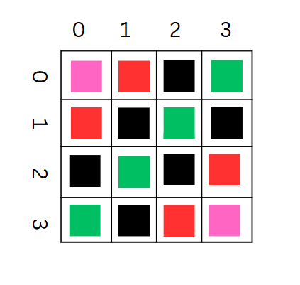

## Problem Statement
[A-Diagonals](https://codeforces.com/problemset/problem/1995/A)

## Solution
Greedly select the diagonal which can accomodate the maximum number of chips, this will be the diagonal with max length, for diagonals of smaller length there are two on either sides of the main diagonal. 
<br>
In the figure below, the green squares get filled first, then then black, then the black, followed by red and pink.
This can be checked by checking parity of `count`.
<br>


## Code
```cpp
#include <bits/stdc++.h>
using namespace std;
void solve() {
    int n, k;
    int count;
    cin >> n >> k;
    count = 0;
    while(k > 0 && n > 0) {
        k -= n;
        count++;
        if(count & 1)
            n--;
    }
    if(n < 0)
        cout << "-1\n";
    else
        cout << count << "\n";
}
int main() 
{
    int t;
    cin >> t;
    while(t--) {
        solve();
    }
    return 0;
}
```

## Analysis
Time Complexity: For each test case <i>O(n)</i>
<br>
Space Complexity: <i>O(1)</i>
